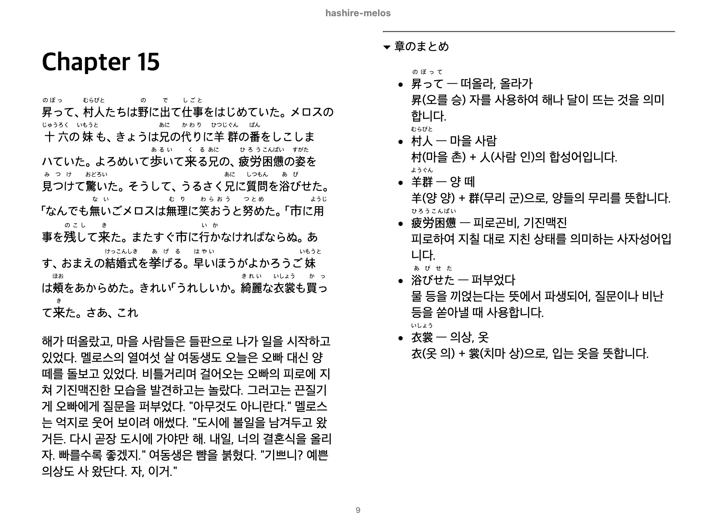
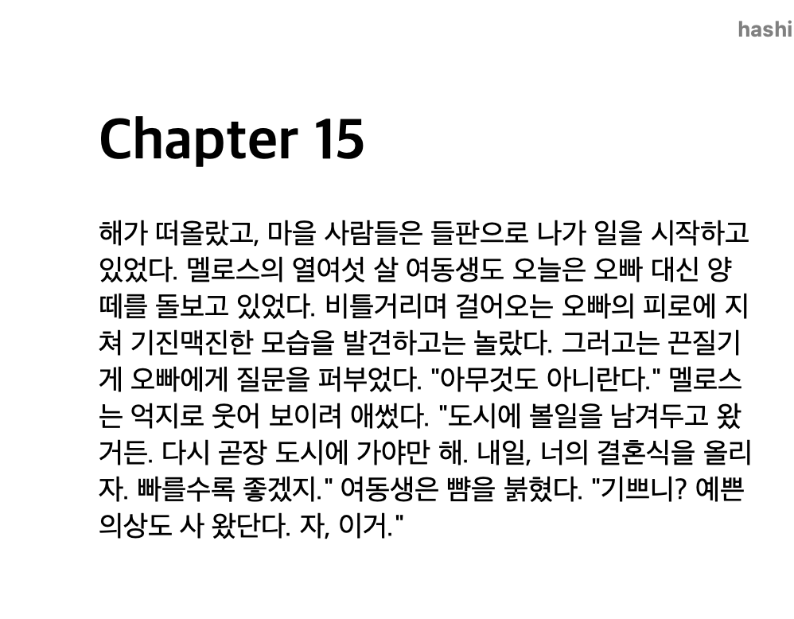

# ln-epub-translator: Epub Translator for Light Novels
Forked from [epub-traslator](https://github.com/oomol-lab/epub-translator)

Translate light novels for studying kanji and elemental Japanese expressions. You can also obtain a clean translation version. Resulting epubs preserve all formatting, images, and structure.




## Documents for Other Languages
- [한국어](./docs/KO_README.md)

## Quickstart

### Environment (Install [uv](https://docs.astral.sh/uv/getting-started/installation/))
```sh
# Windows - open cmd and execute following command
winget install --id=astral-sh.uv -e
# Linux, MacOS
curl -LsSf https://astral.sh/uv/install.sh | sh
```
### Config file
1. Copy `format.template.json` to `format.json`.
2. Replace the "key", "url" and "model" with actual values. You can use any openai-compatiable APIs.

Recommended values are:
```json
{
  "key": "your-actual-api-key-from-ai-studio",
  "url": "https://generativelanguage.googleapis.com/v1beta/openai/",
  "model": "gemini-3.1-flash-lite",
  "token_encoding": "o200k_base",
  "timeout": 360.0,
  "retry_times": 10,
  "retry_interval_seconds": 0.75,
  "translation": {
    "temperature": 0.8,
    "top_p": 0.6
  },
  "fill": {
    "temperature": [0.2, 0.9],
    "top_p": [0.9, 1.0]
  },
  "study": {
    "temperature": 0.3,
    "top_p": 0.9,
    "extra_body": null
  }
}
```
### Dictionary (Optional)
You can give instructions to LLM.
```md
## Characters
- 放虎原ひばり: 호코바루 히바리
- 馬剃天愛星: 바소리 티아라
- 志喜屋夢子: 시키야 유메코
## Notes
- Use informal speech for first-person narrative
```
Create a file to `path/to/dict.md`.
```- name1: name2``` will be parsed into key-value pair, separated by colons.
If there is no colon, it will be interpreted as notes.

You can check example in [here](./example.dict.md)

### Run translator
```sh
uv run scripts/translate_for_study.py path/to/book.epub --dict path/to/dict.md -l Korean
# Translation progress is saved in "out" directory. You can check progress in out/<book_name>/_progress.html
# Resume from stopped location
uv run scripts/translate_for_study.py path/to/book.epub --dict path/to/dict.md -l Korean --resume
```
Output will be in `out` directory.

### Expected Output
```sh
out
├── <your_book_name>
│   ├── logs
│   │   ├── request 2026-06-21 02-39-23.log
│   │   ├── request 2026-06-21 02-39-26.log
...
│   │   ├── request 2026-06-21 02-48-28.log
│   │   └── request 2026-06-21 02-48-42.log
│   ├── _progress.html
│   ├── _state.json
│   ├── translated_study.epub
│   └── translated_study.clean.epub
```
- _progress.hmtl: For checking translation progress
- translated_study.epub: epub file with original text + translated text
- translated_study.clean.epub: epub file with only translated text