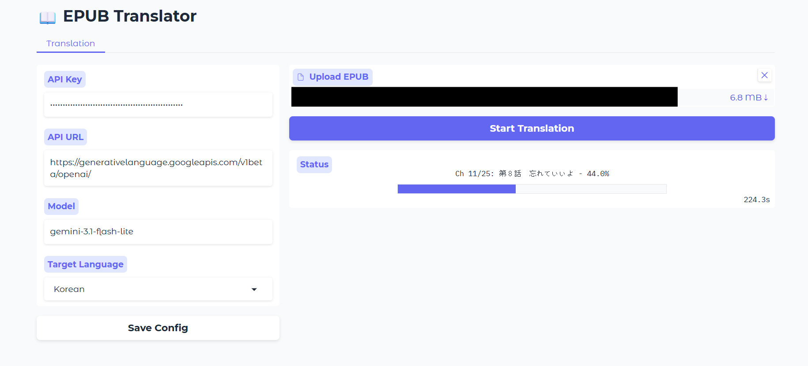
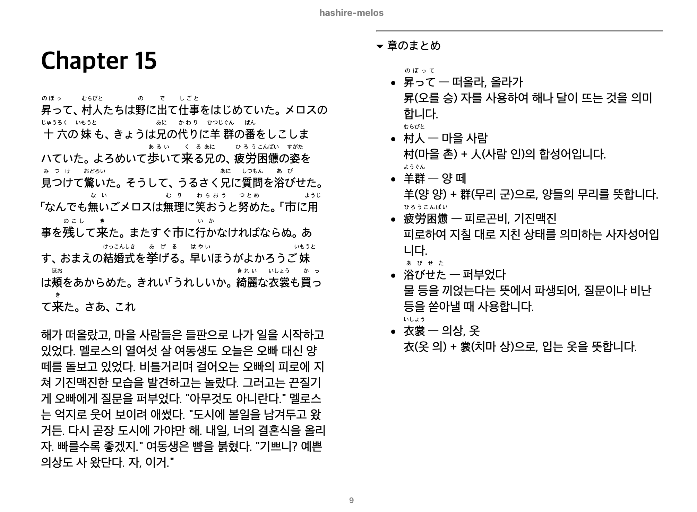

# ln-epub-translator: Epub Translator for Light Novels
Forked from [epub-traslator](https://github.com/oomol-lab/epub-translator)

<div align="center">English | <a href="docs/KO_README.md">한국어</a></div>

Translate light novels for studying kanji and elemental Japanese expressions. You can also obtain a clean translation version. Resulting epubs preserve all formatting, images, and structure.
Supports webui for easy usage.





## Quickstart (webui)

### Environment (Install [uv](https://docs.astral.sh/uv/getting-started/installation/))
```sh
# Windows - open cmd and execute following command
winget install --id=astral-sh.uv -e
# Linux, MacOS
curl -LsSf https://astral.sh/uv/install.sh | sh
```
### Run webui (recommended)
```sh
uv run scripts/run_webui.py
```
Now, you can access webui at `http://localhost:2527`

Recommended settings:
- API Key: "your-actual-api-key-from-ai-studio"
- API URL: "https://generativelanguage.googleapis.com/v1beta/openai/"
- MODEL: "gemini-3.1-flash-lite"

Then, click `Save Config` button.
Upload your epub file and click `Start Translation` button.

## CLI (for advanced user)
```sh
uv run scripts/translate_for_study.py --dict path/to/dict.md path/to/book.epub -l Korean
```

### Config file
1. Copy `format.template.json` to `format.json`.
2. Replace the "key", "url" and "model" with actual values. You can use any openai-compatiable APIs.

Recommended values are:
```json
{
  "key": "your-actual-api-key-from-ai-studio",
  "url": "https://generativelanguage.googleapis.com/v1beta/openai/",
  "model": "gemini-3.1-flash-lite",
  "token_encoding": "o200k_base",
  "timeout": 360.0,
  "retry_times": 10,
  "retry_interval_seconds": 0.75,
  "translation": {
    "temperature": 0.8,
    "top_p": 0.6
  },
  "fill": {
    "temperature": [0.2, 0.9],
    "top_p": [0.9, 1.0]
  },
  "study": {
    "max_output_tokens": 16384,
    "temperature": 0.3,
    "top_p": 0.9,
    "extra_body": null
  }
}
```
### Translator notes / Dictionary (Optional)
Pass a UTF-8 text file with `--dict`. Its full contents are sent to the LLM as translator notes, without parsing or reformatting. No required headings, bullets, or `name: translation` syntax; existing Markdown dictionaries also work.

For example, save this as `notes.txt`:
```text
Translate 放虎原ひばり as 호코바루 히바리.
馬剃天愛星 should be 바소리 티아라.

Use informal speech for first-person narrative.
Keep dialogue natural.
```
```sh
uv run scripts/translate_for_study.py path/to/book.epub --dict notes.txt -l Korean
```

You can check example in [here](./example.dict.md)

#### Name scope and translation fidelity
The prompt treats a full-name dictionary entry as identity/spelling guidance, not a command to expand every mention. For example, with `温水和彦 = 누쿠미즈 카즈히코`, source `温水` stays `누쿠미즈`, `和彦` stays `카즈히코`, and only `温水和彦` becomes the full name. A name plus an honorific must not be replaced with a nickname merely because they refer to the same person.

The prompt also asks the model to:
- Preserve pronouns, omitted subjects, titles, dialogue versus inner thoughts, negation, uncertainty, conditions, numbers, and who did what to whom.
- Use notes only for the current paragraph; cover useful compounds even when they repeat.
- Prefer supported readings and contextual meanings over invented character labels or speculative etymologies. Omit an uncertain breakdown rather than invent one.

These are model instructions, not deterministic name rewriting or dictionary verification. A live `gemma4:31b` check passed 18 Korean and 4 English name-scope cases; a repeated vocabulary explanation was still omitted in a separate 12-paragraph sample. Review the output, especially study notes. New requests use the updated prompt; `--resume` does not rewrite completed chapters.


### Run translator
```sh
uv run scripts/translate_for_study.py path/to/book.epub --dict path/to/dict.md -l Korean
# Translation progress is saved in "out" directory. You can check progress in out/<book_name>/_progress.html
# Resume from stopped location
uv run scripts/translate_for_study.py path/to/book.epub --dict path/to/dict.md -l Korean --resume
```
Output will be in `out` directory.

### Paragraph-local study notes
Study translation requests tagged text instead of JSON:
```html
<p>번역을 배운다.</p> <study>翻訳(ほんやく): 翻(번역할 번) + 訳(번역할 역); '번역'을 뜻하는 한자어</study>
<p>조금 쉬자.</p>
```
Each source paragraph has one translated `<p>` in the same order, followed by zero or more `<study>` notes. Notes are free-form prose; line breaks, tag casing, and missing study closing tags are tolerated. Complete, nonempty translation paragraphs are still required so missing text cannot silently shift paragraph alignment.
Ruby bases (`<rb>`) stay in their enclosing source paragraph. Readings and fallback text inside `<rt>`, `<rp>`, or `<rtc>` are excluded from translation requests, including nested markup. Blocks without visible source text are not sent to the model.

- Study EPUB and `_progress.html`: original with furigana, then translation and always-visible notes on the same line when space permits. Long notes wrap naturally.
- Clean EPUB: translation only; no original or study notes.
- Notes remain next to every occurrence, with no chapter-end glossary. The preview's book-end glossary and vocabulary count index recognizable `expression(reading): explanation` notes only; other prose is still displayed in full next to its paragraph.
- Incomplete/mismatched responses use smaller split batches. A failed single paragraph stops translation rather than marking its chapter complete.
- `--resume` retains already-completed chapters as saved. To apply this format to an older translation, start a fresh run in a different output directory, such as `-o out-text`.

Output defaults to a **16384-token maximum per request**. Set `study.max_output_tokens` in `format.json` (also used by the Web UI), or override it for one CLI run:
```sh
uv run scripts/translate_for_study.py book.epub -l Korean --max-output-tokens 16384
```
The limit must be a positive integer within your provider's supported range. Raising it allows longer answers but does not force the model to use the entire budget. Responses cached under a different output limit are not reused.

For Gemma with long explanations, start conservatively with `-b 1200 --max-paragraphs 12` and adjust after checking `_progress.html`; larger batches can still introduce formatting and factual errors. A `<study>` mistakenly closed with `</p>` is tolerated when its translation paragraph is already complete. Kanji readings and character explanations generated by the model still need checking.

Live Ollama `gemma4:31b` check: a 60-paragraph, 5198-character length-stress fixture (the same 30 authored paragraphs repeated twice) hit the 4096-token cap after 44 complete translations (`finish_reason=length`). With a 16384 cap, it completed all 60 in 5734 output tokens (`stop`). It nevertheless omitted study notes for the repeated half, and some generated kanji explanations were inaccurate in the 30-paragraph run. More output headroom does not replace smaller batches or content review.

For Ollama Cloud's OpenAI-compatible API, use `https://ollama.com/v1`, **not** `https://ollama.com/api/v1` ([official documentation](https://docs.ollama.com/api/openai-compatibility)).

### Expected Output
```sh
out
├── <your_book_name>
│   ├── logs
│   │   ├── request 2026-06-21 02-39-23.log
│   │   ├── request 2026-06-21 02-39-26.log
...
│   │   ├── request 2026-06-21 02-48-28.log
│   │   └── request 2026-06-21 02-48-42.log
│   ├── _progress.html
│   ├── _state.json
│   ├── translated_study.epub
│   └── translated_study.clean.epub
```
- _progress.hmtl: For checking translation progress
- translated_study.epub: epub file with original text + translated text
- translated_study.clean.epub: epub file with only translated text
