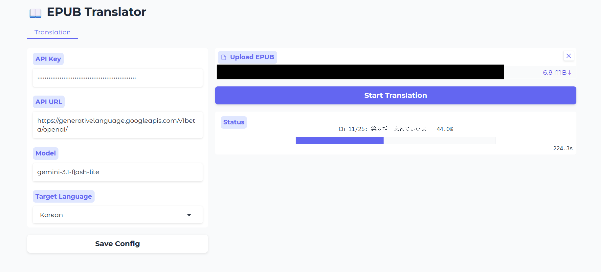

# ln-epub-translator: 라이트 노벨용 EPUB 번역기


## 환경 설정 (uv 설치)
1. [uv 설치 가이드](https://docs.astral.sh/uv/getting-started/installation/)를 참고하여 `uv`를 설치

```sh
# Windows - cmd를 열고 다음 명령어를 실행
winget install --id=astral-sh.uv -e
# Linux, macOS
curl -LsSf https://astral.sh/uv/install.sh | sh
```

### webui 실행 (추천)
```sh
uv run scripts/run_webui.py
```
`http://localhost:2527` 를 브라우저에서 열기

추천 세팅:
- API Key: "your-actual-api-key-from-ai-studio"
- API URL: "https://generativelanguage.googleapis.com/v1beta/openai/"
- MODEL: "gemini-3.1-flash-lite"

`Save Config` 버튼을 클릭해서 설정 저장.
epub파일 업로드한 다음 `Start Translation` 버튼을 눌러서 번역 시작.


## CLI (고급 사용자용)
### 설정 파일

1. `format.template.json` 파일을 `format.json`으로 복사
2. `"key"`, `"url"`, `"model"` 값을 실제 값으로 교체. openai랑 호환되는 API 사용 가능.

권장 설정:
```json
{
  "key": "ai-studio에서-발급받은-api키",
  "url": "https://generativelanguage.googleapis.com/v1beta/openai/",
  "model": "gemini-3.1-flash-lite",
  "token_encoding": "o200k_base",
  "timeout": 360.0,
  "retry_times": 10,
  "retry_interval_seconds": 0.75,
  "translation": {
    "temperature": 0.8,
    "top_p": 0.6
  },
  "fill": {
    "temperature": [0.2, 0.9],
    "top_p": [0.9, 1.0]
  },
  "study": {
    "temperature": 0.3,
    "top_p": 0.9,
    "extra_body": null
  }
}
```

### 사전 설정 (선택 사항)

LLM에 추가 지시사항을 제공할 수 있음.

```md
## Characters
- 放虎原ひばり: 호코바루 히바리
- 馬剃天愛星: 바소리 티아라
- 志喜屋夢子: 시키야 유메코

## Notes
- 1인칭 서술은 반말로 번역할 것
```

`path/to/dict.md` 파일을 생성해서 저장.

`- name1: name2` 형식의 항목은 콜론(`:`)을 기준으로 키-값 쌍으로 처리되고 콜론이 없는 항목은 메모(Notes)로 해석됨.

예시는 [example.dict.md](../example.dict.md)

### 번역 실행

```sh
uv run scripts/translate_for_study.py path/to/book.epub --dict path/to/dict.md -l Korean
# 번역 진행상황은 out 디렉토리에 저장됨. 진행상황은 out/<책 이름>/_progress.html 파일에서 확인 가능
# 중단된 지점에서 이어서 번역
uv run scripts/translate_for_study.py path/to/book.epub --dict path/to/dict.md -l Korean --resume
```

출력 파일은 `out` 디렉터리에 생성됨.

### 결과물
```sh
out
├── <책 이름>
│   ├── logs
│   │   ├── request 2026-06-21 02-39-23.log
│   │   ├── request 2026-06-21 02-39-26.log
...
│   │   ├── request 2026-06-21 02-48-28.log
│   │   └── request 2026-06-21 02-48-42.log
│   ├── _progress.html
│   ├── _state.json
│   ├── translated_study.epub
│   └── translated_study.clean.epub
```
- _progress.hmtl: 진행상황 확인용
- translated_study.epub: 원문 + 번역문이 있는 epub 파일
- translated_study.clean.epub: 번역문만 있는 epub 파일